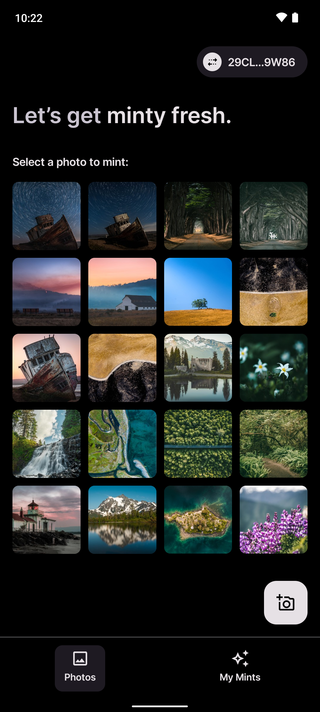
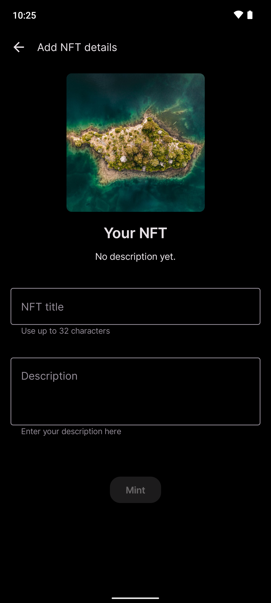
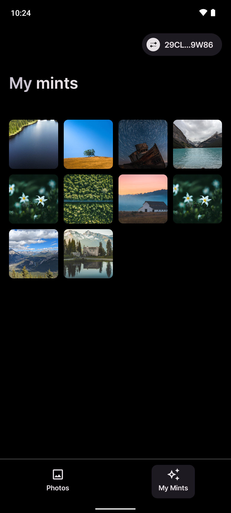
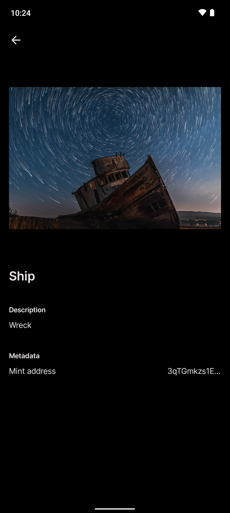
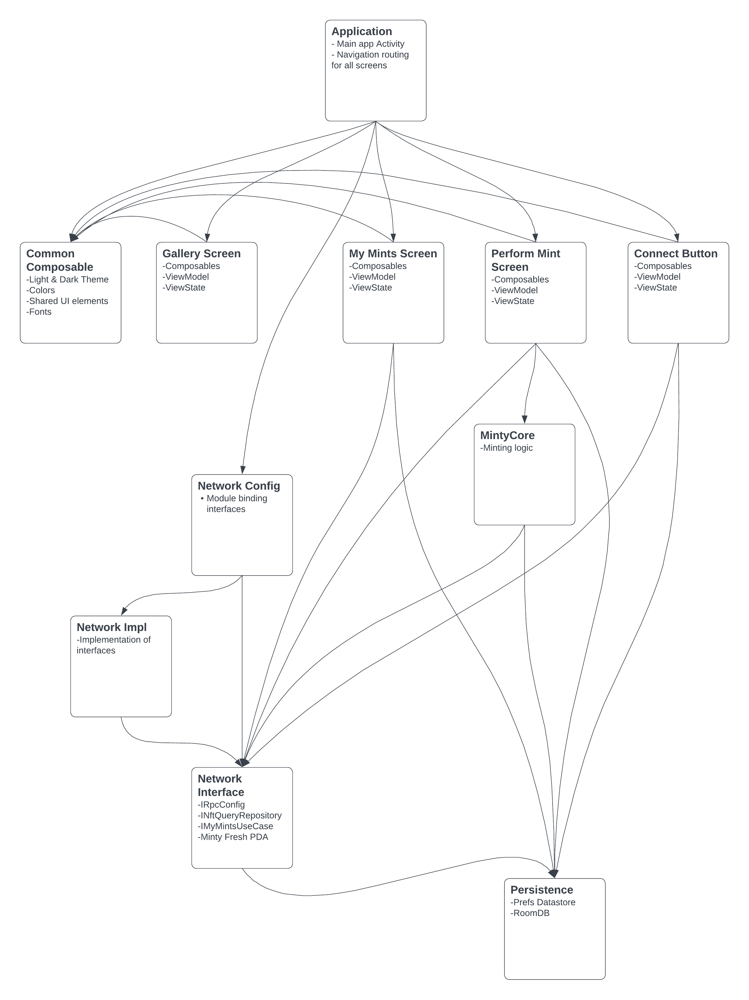

<div align="center">
    
</div>

<div align="center">

[](http://makeapullrequest.com)
[](https://developer.android.com/jetpack/androidx/versions/all-channel)
[](https://github.com/solana-mobile/Minty-fresh/network)
[](https://github.com/solana-mobile/Minty-fresh/stargazers)
[](https://github.com/solana-mobile/Minty-fresh/issues)
[](https://github.com/solana-mobile/Minty-fresh/blob/main/LICENSE.md)
[](https://github.com/solana-mobile/Minty-fresh/releases/latest)
[](https://twitter.com/solanamobile)

</div>

# Minty Fresh

A quick, snappy sentence hyping Minty Fresh! (We should write this as a team)

<!-- This would be a great place to include our store download badge -->

## Take a Look 

| Screenshot 1 | Screenshot 2                                   | Screenshot 3                               | Screenshot 4                                      |
|---|------------------------------------------------|--------------------------------------------|---------------------------------------------------|
 |  |  |  |

## Technologies

Minty Fresh is built using 100% native Kotlin Android code, and is meant to demonstrate a best-in-breed implementation of native mobile dApp. Some implementation highlights:

- Extensive use of [Mobile Wallet Adapter](https://github.com/solana-mobile/mobile-wallet-adapter)
- 100% Jetpack Compose UI w/ Material 3
- Coroutines with Flow & StateFlow
- Multi-module app
- Hilt Dependency Injection
- Room local database

## Building & Running

```shell
git clone git@github.com:solana-mobile/Minty-fresh.git
cd Minty-fresh
```

When opening the project in Android Studio, be sure to select the `build.gradle.kts` file from the project root.

## Implementation Overview

Minty Fresh is a multi-module Android application, which means that the source code is broken up into logical code packages that variously depend on each other. 

Roughly speaking, the modules are separated out based on "layers" of app logic, e.g.; UI modules, business logic, networking/data storage modules and the like.

The following is a module dependency diagram, showing the modules that exist in the app and how they depend on each other:



Each module in the application has its own readme file, which is linked here:

### App & Screen Modules

- [Root Application module](app)
- [Photo selection "gallery"](ui/gallery)
- ["My Mints" Screens](ui/mymints)
- [NFT minting screen](ui/nftMint)
- [Wallet Connect Button](ui/walletConnectButton)
- [Shared composable](ui/commonComposable)

### Logic Modules

- [NFT minting logic](libs/mintycore)
- [Persistence/local storage](libs/persistence)
- [Networking interfaces](libs/networkInterface)
- [Networking implementation](libs/networkInterfaceImpl)
- [Network interface bindings](libs/networkConfigs)

## License

[Apache 2.0](https://github.com/solana-mobile/Minty-fresh/blob/main/LICENSE.md)
